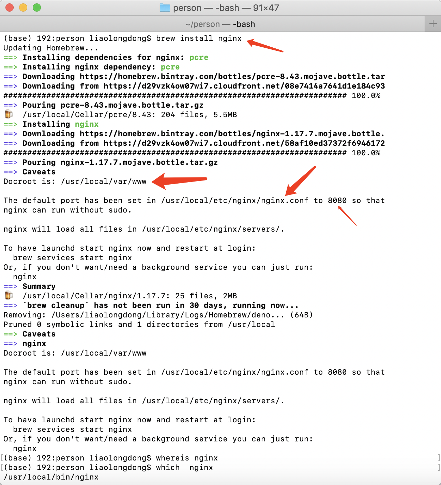

# mac_install_nginx

## 默认配置

Docroot is: /usr/local/var/www

The default port has been set in /usr/local/etc/nginx/nginx.conf to 8080 so that
nginx can run without sudo.

nginx will load all files in /usr/local/etc/nginx/servers/.

To have launchd start nginx now and restart at login:
  brew services start nginx
Or, if you don't want/need a background service you can just run:
  nginx

```bash
# 查找nginx安装路径
which nginx
# /usr/local/bin/nginx

# 启动nginx
/usr/local/bin/nginx

# 修改nginx.conf配置文件，需重启nginx才能生效
/usr/local/bin/nginx -s reload

# 快速停止nginx
/usr/local/bin/nginx -s stop

# 完整有序停止nginx
/usr/local/bin/nginx -s quit

# 设置目录或文件访问权限，如果没有相关文件权限访问报403错误，禁止访问
# 目录授权 - root 用户下运行，可以设置执行文件夹权限改为对所有用户可读，可写，可执行
chmod 777 demo -R # 修改demo文件夹访问权限
chmod 777 nginx.conf # 修改nginx.conf文件访问权限

```

