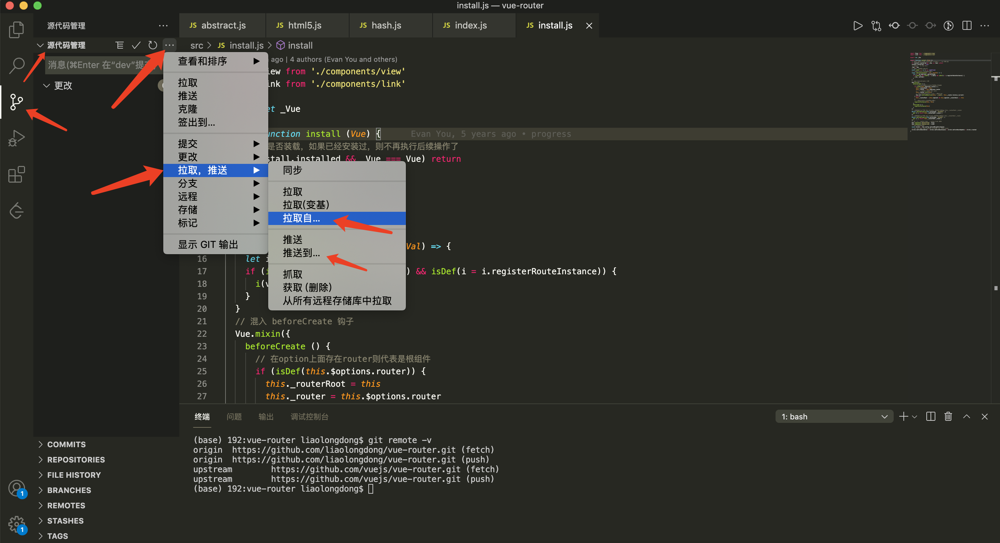
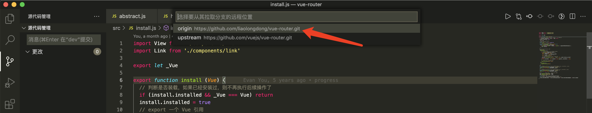
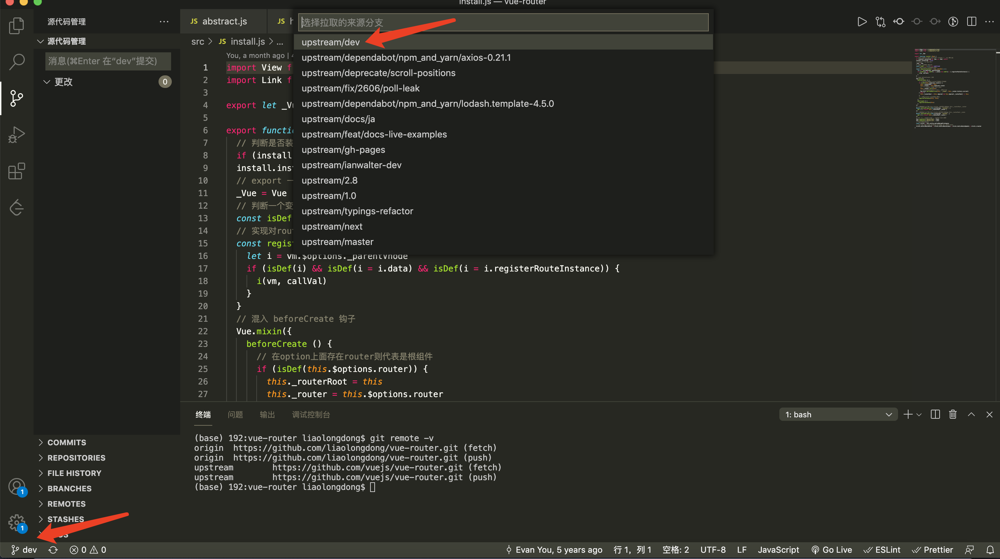

# gitlab_fork模式

## fork远程上游仓库到开发者个人仓库

以`github`开源项目`vue-router`为例


## 关联上游远程仓库

```bash
# 查看本地项目关联远程仓库地址
git remote -v

# 删除origin关联的远程仓库地址
git remote remove origin

# 重命名关联仓库名称
git remote rename <repo> <new-repo>

# 添加远程仓库新地址
git remote add origin <url>
```

## 本地与上游仓库代码、分支同步

一、源仓库新增加了分支，如何同步到自己的仓库，
二、源仓库某个分支代码更新了，如何同步到本地仓库相应的分支

问题一：同步新分支到fork仓库

1、首先我们先克隆fork仓库

```bash
git clone https://github.com/liaolongdong/vue-router.git
```

2、然后增加源仓库

```bash
git remote add upstream https://github.com/vuejs/vue-router.git  # (upstream 为源仓库名字，后面会使用到)git fetch upstream（获取源仓库信息） 
```

3、然后拉取源仓库分支

```bash
git checkout -b branchName upstream/branchName #（branchName为分支名字）
```

4、然后上传到fork仓库

```bash
git push origin branchName
```

问题二：同步分支代码

1、首先切换到需要更新的分支

```bash
git checkout -b branchName origin/branchName
```

2、拉取源仓库分支内容

```bash
git pull upstream branchName
```

3、然后上传到fork仓库

```bash
git push origin branchName
```

## 使用vscode完成更新上游远程仓库代码并推送到下游(个人/本地)远程仓库

1. 使用vscode完成更新上游远程仓库代码并推送到下游(个人/本地)远程仓库

2. 拉取哪个仓库的代码更新到本地

3. 拉取与本地对应的分支更新到本地


推送到远程仓库，和以上类似

[gitlab仓库使用fork模式下的同步](https://www.jianshu.com/p/fad8ffc9aeff)
